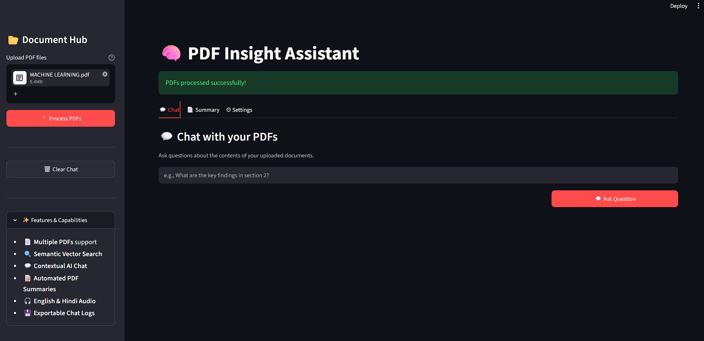
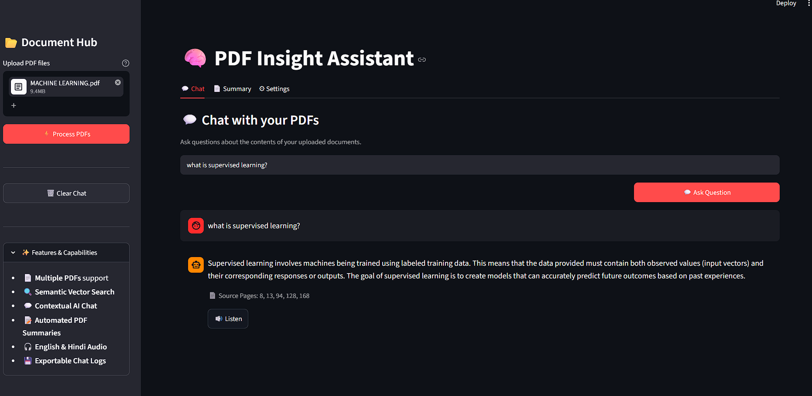
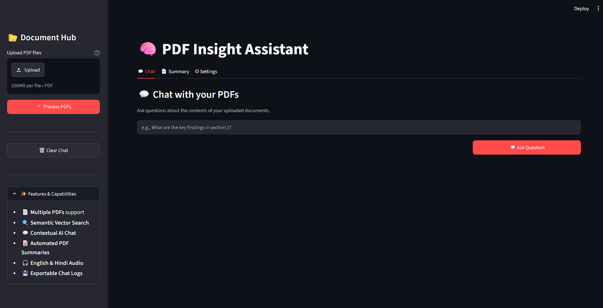
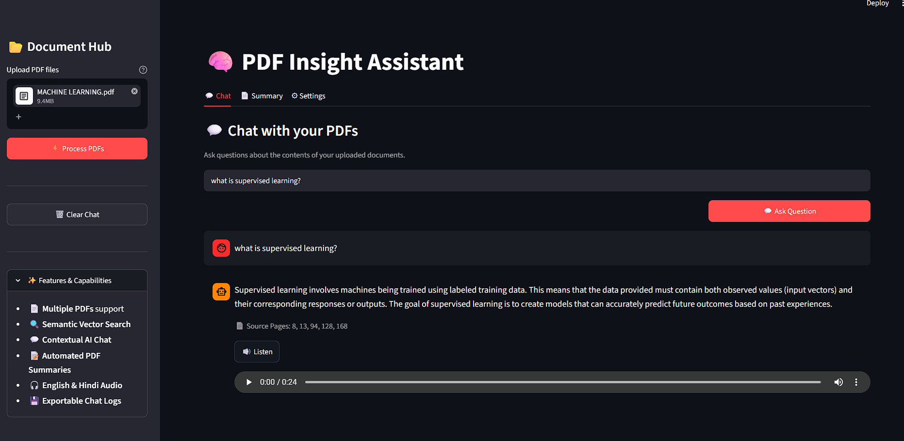
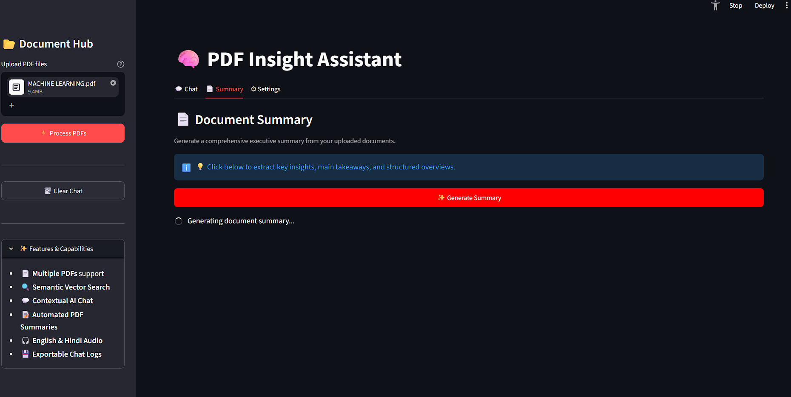
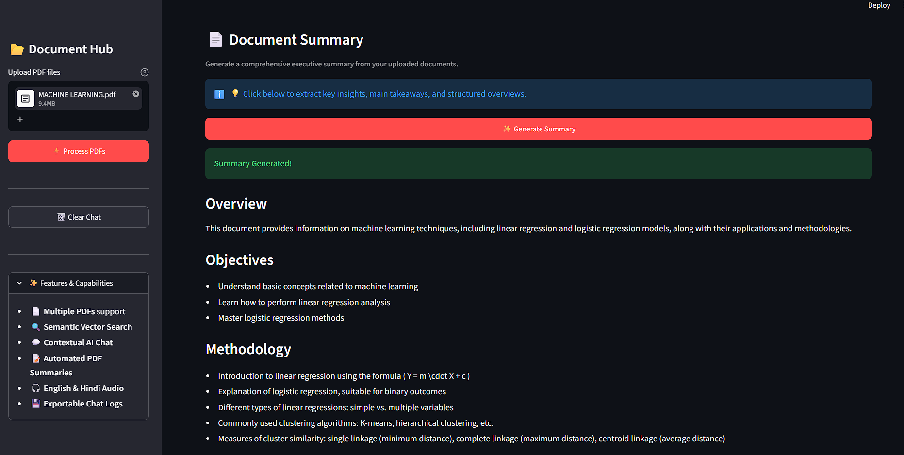
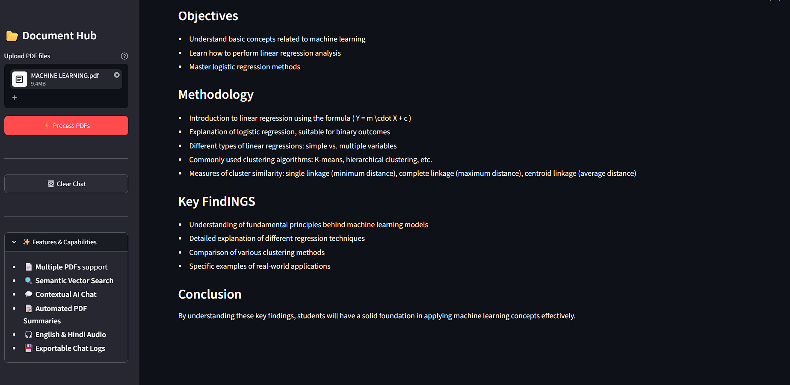
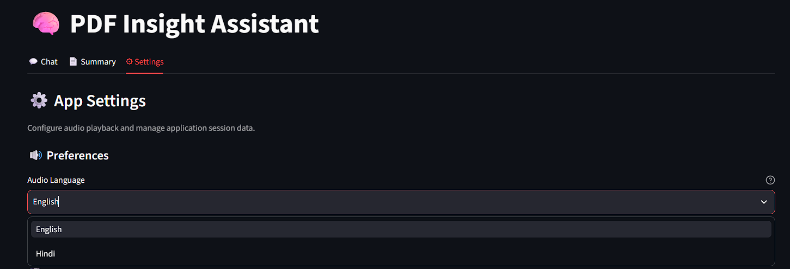
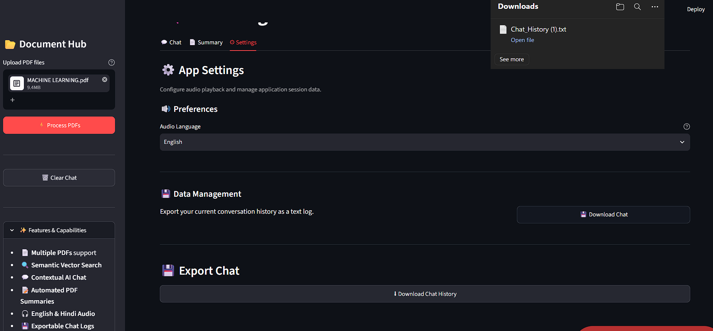

# 🧠 Smart PDF Insight Assistant

An AI-powered PDF Question Answering system built using **Retrieval-Augmented Generation (RAG)**, **FAISS Vector Database**, and **Hugging Face Large Language Models**.

The application enables users to upload one or multiple PDF documents, ask questions in natural language, generate document summaries, listen to answers in English or Hindi, and download chat history.

---

# ✨ Features

- 📄 Upload Multiple PDF Files
- 🤖 AI-powered Question Answering
- 🔍 Semantic Search using FAISS
- 📝 Automatic Document Summary
- 📚 Source Page Citation
- 🔊 English & Hindi Audio Playback
- 💾 Download Chat History
- 💻 Local Deployment using Streamlit

---

# 🏗️ System Architecture

```
                User
                  │
                  ▼
        Upload PDF Documents
                  │
                  ▼
          PDF Text Extraction
                  │
                  ▼
            Text Chunking
                  │
                  ▼
        Sentence Embeddings
                  │
                  ▼
      FAISS Vector Database
                  │
                  ▼
        Semantic Retrieval
                  │
                  ▼
       Large Language Model
                  │
                  ▼
   Answer / Summary / Audio
```

---

# ⚙️ Technologies Used

| Technology            | Purpose             |
| --------------------- | ------------------- |
| Python                | Backend             |
| Streamlit             | User Interface      |
| LangChain             | RAG Pipeline        |
| HuggingFace           | Embeddings & LLM    |
| Sentence Transformers | Text Embeddings     |
| FAISS                 | Vector Database     |
| gTTS                  | Text-to-Speech      |
| PyPDF                 | PDF Text Extraction |

---

# 📂 Project Structure

```
PDF Insight Assistant
│
├── backend
│   ├── audio.py
│   ├── download_chat.py
│   ├── llm.py
│   ├── pdf_handler.py
│   ├── rag_pipeline.py
│   └── summary.py
│
├── ui
│   ├── chat.py
│   ├── settings.py
│   ├── sidebar.py
│   └── summary_tab.py
│
├── screenshots
│
├── app.py
├── config.py
├── requirements.txt
└── README.md
```

---

# 📸 Screenshots

## 🏠 Home Screen



---

## 💬 Chat with PDF



---

## 📄 Source Page Citation



---

## 🔊 Audio Playback



---

## 📝 PDF Summary








---

## ⚙️ Settings



---

## 💾 Download Chat



---

# 🚀 Installation

Clone the repository

```bash
git clone https://github.com/Shreyajc/PDF-Insight-Assistant.git
```

Move inside the project

```bash
cd PDF-Insight-Assistant
```

Create Virtual Environment

```bash
python -m venv venv
```

Activate Virtual Environment

Windows

```bash
venv\Scripts\activate
```

Install Dependencies

```bash
pip install -r requirements.txt
```

Run the Application

```bash
streamlit run app.py
```

---

# 🔄 Workflow

1. Upload one or more PDF files.
2. Extract text from the uploaded PDFs.
3. Split the text into smaller chunks.
4. Generate embeddings using Sentence Transformers.
5. Store embeddings in FAISS.
6. Retrieve the most relevant chunks based on the user query.
7. Generate an answer using the Large Language Model.
8. Display the answer with source page citations.
9. Optionally generate audio or download the chat history.

---

# 🔮 Future Scope

- OCR support for scanned PDFs
- Cloud Deployment
- Larger LLM Integration
- Better Multilingual Support
- PDF Annotation & Highlighting

---

# 👨‍💻 Author

**Shreya Jadhav**

MCA Mini Project

---

# ⭐ If you found this project useful, consider giving it a star!
